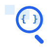

<div align="center">
  
  <h1>CodeLens AI</h1>
  <p><strong>Visual Programming Tutor for Computer Science Students</strong></p>
  
  [](LICENSE)
  [](https://github.com/codelens-ai/codelens-ai/actions/workflows/ci.yml)
  [](CONTRIBUTING.md)
</div>

## 🎯 About CodeLens AI

CodeLens AI is an innovative educational platform that transforms how first-year computer science students learn programming by making abstract concepts **visible and interactive**. Unlike traditional coding tutors that merely explain syntax, CodeLens AI provides a "computational microscope" that lets students literally see how their code executes step-by-step in real-time.

### 🔍 Key Innovation

While existing tools tell students *what* their code does, CodeLens AI shows them *how* it works internally through:

- **Live execution visualization** with variable tracking
- **Interactive debugging** with predictive learning
- **Progressive skill-building** from fundamentals to mastery
- **Multimodal interaction** (voice, visual, text)

## 🚀 Core Features

### 1. Try Me - Visual Execution Laboratory
Students can paste any Python code and watch it execute line-by-line with:
- Real-time variable state visualization
- Memory allocation tracking
- Control flow diagrams
- Predictive engagement prompts

### 2. Debug - Intelligent Error Resolution
When code breaks, students get:
- Root cause analysis with plain-language explanations
- Visual flowchart of what went wrong
- Corrected code with change highlighting
- Common misconception identification

### 3. Ideas - Project Planning Assistant
Transforms vague ideas into concrete plans:
- Step-by-step implementation roadmaps
- Algorithm pseudocode with visual flowcharts
- Resource recommendations with direct links
- File structure templates and best practices

### 4. Practice Task - Gamified Learning Path
Structured curriculum (Levels 1-15) featuring:
- Progressive difficulty challenges
- Automated assessment with human review
- Concept mastery verification
- AI-powered project building assignments

## 🛠️ Technical Excellence

Built with security, scalability, and cost-efficiency in mind:
- Zero-cost deployment using free tiers (HuggingFace, Ollama)
- Bank-grade security with encrypted data handling
- Real-time performance under 2-second response times
- Multilingual support for Python, C, C++, and JavaScript

## 💡 Educational Impact

CodeLens AI addresses the #1 reason CS students drop out: feeling "blind" when coding. By making computation visible and learning interactive, we're not just teaching programming—we're building computational thinking skills that last a lifetime.

## 🏗️ Getting Started

### Prerequisites
- Node.js >= 16
- Python >= 3.9
- Docker (optional but recommended)

### Quick Setup

1. Clone the repository:
```bash
git clone https://github.com/codelens-ai/codelens-ai.git
cd codelens-ai
